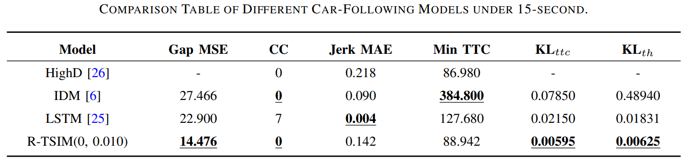
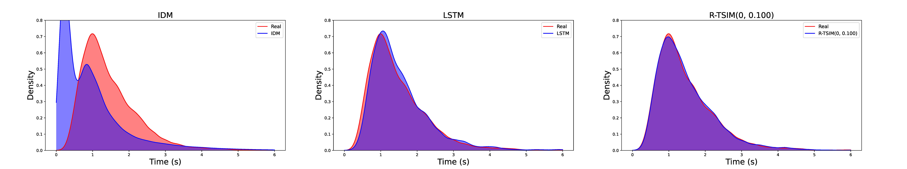
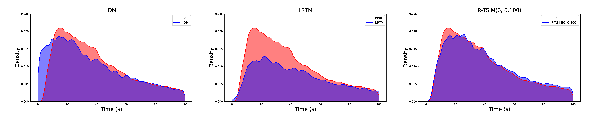
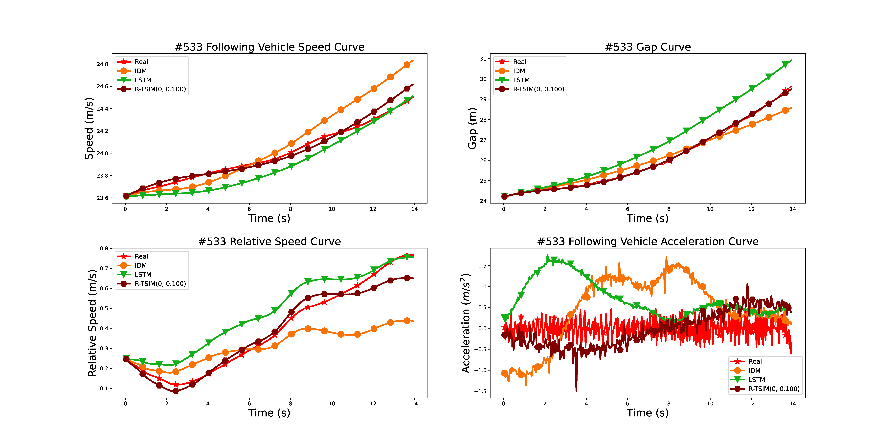
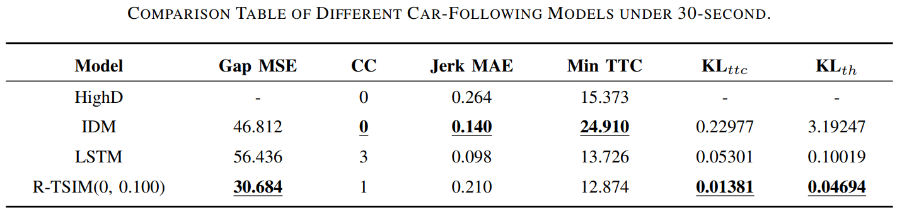
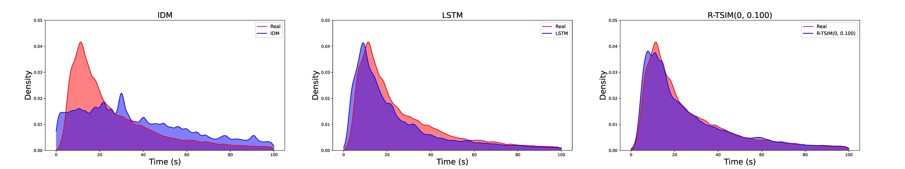
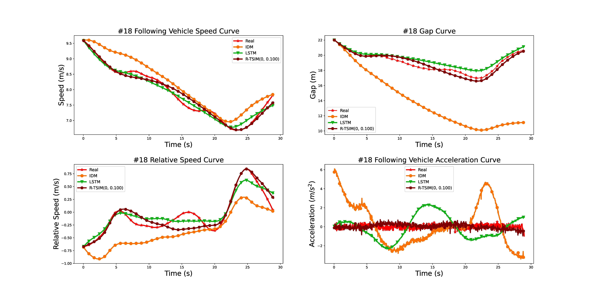

# R-TSIM: A Robust Time-Series Independent Car-Following Model


See the R-TSIM for full documentation on training, testing. See below for quick start examples.

## 1. Install

Clone repo and install requirements.txt in a **Python >= 3.9.0** environment, including **PyTorch >= 2.4.1**.

```shell
git clone https://github.com/LiangzgJlu/R-TISM.git
cd R-TISM
pip install -r requirements.txt
```

## 2. DataSet Preparation

Download car-following data extracted from the HighD dataset from a [Google Drive](https://drive.google.com/drive/folders/1rLMe_x64DdZwBfV1218FtgiGem-ScXjV?usp=sharing). Move the downloaded HighD car-following dataset to the data directory.

## 3. Training

The commands below reproduce **R-TSIM**. 

```python
python train.py --log_path ./log/ --checkpoint_save_path check_points/my_r-tsim_25_0_1.pt  --history_windows_length 25 --batch_size 512 --epoche 400 --track_path_15 data/HighD_train_data.npy --track_path_30 data/30_HighD_train_data.npy --noise 0.1  --train
```

## 4 Testing

The following commands are used to test the performance of **R-TSIM**. The network structure weights file r-tsim_25_0_1.pt for R-TSIM can be downloaded from [Google Drive](https://drive.google.com/file/d/1E1iMxtIxi3Ul2JYZXZ08Rs1UntW3wwqx/view?usp=drive_link) and you should moved it into the check_point directory. 

```python
python test.py --model_path ./check_point/r-tsim_25_0_1.pt --log_path ./log --track_path data/HighD_train_data.npy -hwl 25 --mse
```

# Result Show

### 15s car-following scenario







​	Comparison figure of kernel density estimation for time headway distribution under 15-second. The black section represents the time headway histogram of the output from the car-following model, while the red section represents the time headway histogram of the real dataset distribution. The figure intuitively shows that the time headway distribution output by R-TSIM is similar to the real distribution, with a KL$_{th}$ value of 0.00625.



​	Comparison figure of kernel density estimation for TTC distribution under 15-second. The black section represents the TTC histogram of the output from the car-following model, while the red section represents the TTC histogram of the real dataset distribution. The figure intuitively shows that the TTC distribution output by R-TSIM is similar to the real distribution, with a KL$`_{ttc} `$ value of 0.00595.



​	Comparison curves of the following vehicle's speed, gap, relative speed, and acceleration under 15-second. This figure compares the car-following performance of various car-following models with real-world dataset for the 533rd car-following trajectory. In the figure, the red curve directly reflects the car-following state recorded in the real-world dataset, while the other colored curves represent the simulation results of different car-following models. The comparison clearly shows that the R-TSIM model performs the best in terms of car-following state performance.


### 30s car-following scenario




​	Comparison figure of kernel density estimation for time headway distribution under 30-second.  The black section represents the time headway histogram of the output from the car-following model, while the red section represents the time headway histogram of the real dataset distribution. The figure intuitively shows that the time headway distribution output by R-TSIM is similar to the real distribution than other, with a KL$_{th}$ value of 0.04694.



​	Comparison figure of kernel density estimation for TTC distribution under 30-second. The black section represents the TTC histogram of the output from the car-following model, while the red section represents the TTC histogram of the real dataset distribution. The figure intuitively shows that the TTC distribution output by R-TSIM is similar to the real distribution than other, with a KL$_{ttc}$ value of 0.01381.




​	Comparison curves of the following vehicle's speed, gap, relative speed, and acceleration under 30-second. This figure compares the car-following performance of various vehicle-following models with real-world data for the 18rd car-following trajectory. In the figure, the red curve directly reflects the car-following state recorded in the real-world dataset, while the other colored curves represent the simulation results of different car-following models. The comparison clearly shows that the R-TSIM model performs the best in terms of car-following state performance.


